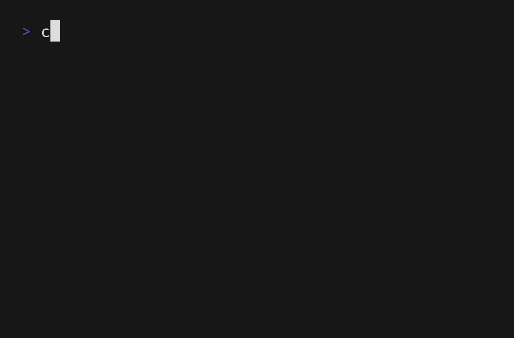

# clgo

clgo is a dependency free [cloc](https://github.com/AlDanial/cloc) implementation made in **Go**.

By default uses concurrency to quickly scan the entry folder and count the lines very quickly.



## Install

You can build it from source:
```sh
git clone https://github.com/Alvesafk/clgo --depth=1
cd clgo
make build
```
After this, you can put the binary on your `$PATH`.

Using `go install`:
```sh
go install github.com/Alvesafk/clgo@latest
```

## Usage

```sh
clgo [flags] <file-or-directory>
```

Examples:

```sh
clgo ./project
clgo --format json --no-progress ./project
clgo --format csv --stats ./main.go
clgo --ignore-ext .md,.txt --recursion 5 ./project
clgo --use-gitignore --exclude-dir vendor --exclude '*.generated.go' ./project
clgo --include '*.go' --languages Go --workers 4 ./project
clgo --max-line-size 64MiB ./project
clgo --show-unknown ./linux
```

### Main flags

```text
--format, -f FORMAT      table, json, or csv
--recursion, -r N        maximum subdirectory depth
--workers N              counting workers; 0 selects automatically
--max-line-size SIZE     maximum bytes per line; 0 is unlimited
--no-concurrency         sequential traversal and counting
--stats                  enable statistics
--progress               force progress outside an interactive terminal
--no-progress            disable progress
```

Progress is enabled automatically only when standard error is an interactive terminal. This avoids ANSI control sequences in redirected logs. On Unix, both `SIGINT` and `S
IGTERM` cancel an active scan.

### Filtering

```text
--include-hidden         include hidden files and directories
--ignore-ext LIST        ignore comma-separated extensions
--exclude-dir GLOB       exclude a directory name or relative-path glob
--exclude GLOB           exclude file globs; repeatable or comma-separated
--include GLOB           include only matching file globs
--languages LIST         include only named languages
--use-gitignore          apply .gitignore rules from each visited directory
--show-unknown           list remaining Unknown files on standard error
--list-languages         print accepted language names
```

The built-in `.gitignore` implementation supports ordinary globs, `**`, directory patterns, comments, negated patterns, and inherited rules. As with many directory walkers
, a negated rule cannot re-include a file below a directory that an earlier rule caused the walker to prune entirely.

## Roadmap

Some stuff that i want to add to **clgo**.
- [ ] Ability to input multiple dirs or files on program entry.
- [ ] Support to more languages and edge cases.
- [ ] Git integration.
- [ ] Better customization with flags.

There is a lot of other stuff to add, but the focus is on this features now.

Thanks for reading, sincerely Alvesafk.
